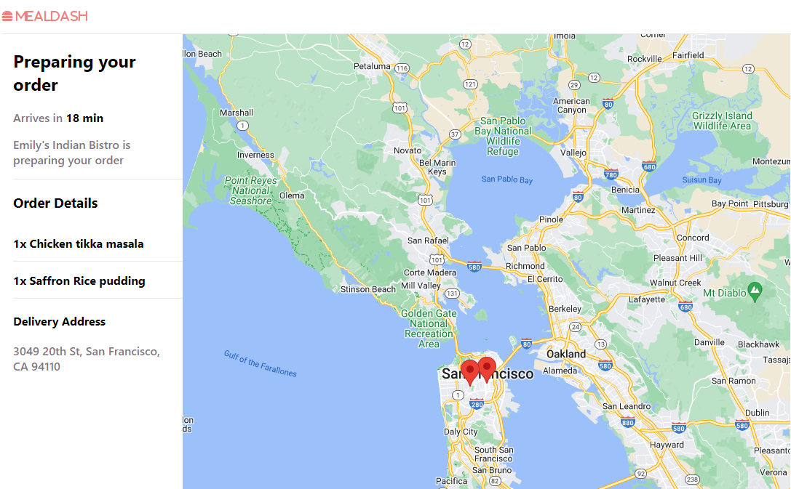

# `MealDash`

## Hungry for an overview?

MealDash is a full stack application that allows users to create their own restaurants, menu items, and book orders from other restaurants to be delivered and viewed in an innovative and user-friendly way. It is designed to mimic the overall core functionality and UI of its more daring parent website, popularly known as DoorDash. 

## Architectural Layout
MealDash is built on a React frontend with a Python flask backend, using SQLITE for development and PostgreSQL for production.

## Frontend Overview
MealDash is very front-end heavy with React that takes care of data filtering, display such as phone fields with various JS functions, and data manipulation from the backend to create new data structures, utilizing cookies and local storage, for best UI experience. 

### Frontend Technologies Used
#### React
Includes API libraries such as reach/combobox, react-google-maps/api, use-places-autocomplete, geocoding, and directions (last 4 are self-contained libraries within Google API).

### Backend Technologies Used
#### Python Flask
Uses wtforms validations and SQLAlchemy ORM for fetching, reading, inserting, and deleting data from a PostgreSQL RDB
Used with wtforms validations and Flask-SQLAlchemy to validate forms and analyze client requests. 

### Instructions on Navigating the Page

## Splash Page
On the splash page, you can view a quick glance of the top 6 restaurants. You can login by clicking "Demo Login" on the top right.

## View Restaurants
Once logged in, you will view the restaurants homepage, listed by the category of cuisine. Each restaurant will be a brief description right below each thumbnail. You can also select the price, avg star rating filters, as well as the cuisine icons to filter restaurants by these categories. 

You can also use the search bar to find specific restaurants by either restaurant name or category.

## Create a Restaurant
Click the top left icon with 3 horizontal dashes, and click "Register Restaurant" to create a restaurant. This will take you to the first page of a 3 step form. You will fill out all the necessary info to properly register your restaurant for other users to order from.

## View Restaurant Page / Update a Restaurant / Delete a Restaurant
Click a restaurant from the main restaurants homepage. This page features the reviews, as well as all the food items that the restaurant offers on its menu.

With _proper authorization_ (eg. you must be the owner of the restaurant to make changes to the restaurant itself), you can update and delete the restaurant that you own, in the top right section next to the restaurant header.

## Create a Menu Item / Update Menu Item / Delete Menu Item
Click "Add to Menu" to take you to the create food item page, where you list the details of a food item for your menu.

With _proper authorization_ (eg. you must be the owner of the restaurant to make changes to the restaurant itself), you can update and delete the food item for the restaurant you own, by clicking the pencil and trashcan icons respectively.

## Creating an Order (Step 1)
Click a food item for a restaurant you don't own, and it will add to the cart pane (which will render upon open or close by toggling the cart icon button on top right). You can select the quantity and specify your preferences.

Once you've selected what you want from the restaurant (only can select from 1 per order), you can proceed to checkout in the cart pane. 

## Creating an Order (Step 2)
In the next page of your order confirmation, you must fill out the address and credit card information to process the order, and optionally choose delivery method. Upon inputting an address (must be within 1 hour drive of the restaurant location), it will calculate the time that will determine the proper update of your order (eg: in progress or completed). When finished, click "Place Order" in right pane.

The address and delivery time is displayed as shown below

## Creating an Order (Step 3) - Order Confirmed!
After you have placed your order, you will see the delivery time, with a countdown that renders properly no matter where you are in the app. However upon log out, local storage will be emptied, so your order will need to be resumed by clicking it in the orders page. Only 1 order may be processed at a time. If the order takes much longer than you prefer, you may delete the order while it is in progress. This will be demonstrated in the next section.

The order will be properly updated with the countdown reaches 0.

## View Orders / Delete Order
Click the top left icon with 3 horizontal dashes, and click "Orders". You will see the Orders you have, categorized by its order status. To delete an order (For my project, update happens automatically when countdown reaches 0 as DoorDash does not allow you to edit an order through the website's core features), click Delete Order.

This is a rough summary of all the features within my app. Feel free to interact with it as much as you like!

## Concluding Remarks
MealDash is meant to be a beautifully crafted app that aims model the parent website, known for upholding its customer-oriented culture. DoorDash is a personal favorite of mine and has many complex functionalities bundled in a modular, mobile-oriented app whose features are constantly being improved. I chose this project not only from personal preference, but also because I see it as a challenging, fun, and long-term journey for future expansion and a self-reflective project that documents my growth as a becoming software engineer. 

